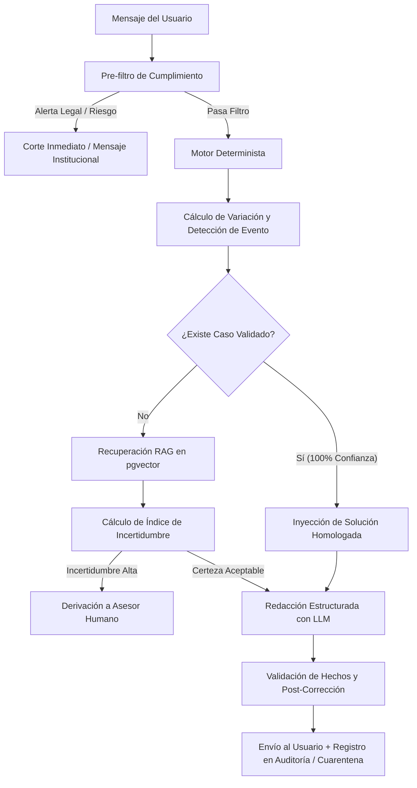

<div align="center">

# Luzmila — Copiloto de Transparencia de Facturación

*Asistente conversacional inteligente que explica variaciones en recibos de telecomunicaciones con desglose exacto al céntimo y aprendizaje supervisado.*

[](https://www.python.org/)
[](https://fastapi.tiangolo.com/)
[](https://www.postgresql.org/)
[](https://supabase.com/)
[](https://www.deepseek.com/)
[](https://developers.facebook.com/docs/whatsapp/cloud-api)

[Visión General](#visión-general) • [Arquitectura](#arquitectura) • [Características](#características) • [Guía Rápida](#guía-rápida) • [Variables de Entorno](#variables-de-entorno) • [Búsqueda Vectorial (RAG)](#búsqueda-vectorial-rag) • [API](#api) • [Canales](#canales) • [Escenarios de Prueba](#escenarios-de-prueba)

</div>

---

## Visión General

**Lucía** es un asistente conversacional diseñado para resolver la principal causa de fricción en telecomunicaciones: las variaciones inesperadas en la facturación mensual. 

A diferencia de los chatbots convencionales que intentan calcular o interpretar montos directamente mediante un modelo de lenguaje (con alto riesgo de alucinación), Lucía implementa una **separación estricta de responsabilidades**:

1. **Motor Determinista**: Un núcleo en Python y SQL calcula con precisión matemática las diferencias entre recibos, aísla los conceptos facturados y clasifica la causa raíz.
2. **Índice de Incertidumbre Calculado**: Evalúa de manera objetiva si existen datos suficientes y precedentes validados para resolver la consulta. Si la incertidumbre supera el umbral, deriva proactivamente a un asesor humano con el expediente completo.
3. **Capa de Lenguaje Natural**: El modelo de lenguaje (DeepSeek vía LangChain) actúa exclusivamente como redactor empático sobre datos pre-verificados, garantizando respuestas comprensibles sin alterar cifras ni fechas.
4. **Aprendizaje Supervisado Continuo**: Los casos nuevos ingresan en cuarentena y, tras la retroalimentación del cliente o la aprobación de un asesor en el panel de administración, se consolidan en la base de conocimiento para resolver futuras consultas idénticas con 100% de confianza.

> [!TIP]
> El proyecto incluye un modo simulado completo (`USE_MOCK_LLM=True` y `USE_MOCK_RAG=True`) que permite ejecutar y probar todas las capacidades localmente con SQLite sin necesidad de credenciales de pago o conexiones externas.

---

## Arquitectura

El sistema está estructurado en cinco capas desacopladas que garantizan trazabilidad, seguridad y escalabilidad:

```
┌────────────────────────────────────────────────────────────────────────┐
│ 1. CANALES DE ENTRADA                                                 │
│    Web Chat UI  │  WhatsApp Cloud API (Webhook + HMAC)  │ Telegram Bot │
└──────────────────────────────────┬─────────────────────────────────────┘
                                   │
┌──────────────────────────────────▼─────────────────────────────────────┐
│ 2. ORQUESTACIÓN Y SESIÓN (orchestrator.py)                             │
│    • Carga de estado y memoria conversacional persistente              │
│    • Clasificación y enrutamiento de intención                         │
└──────────────────────────────────┬─────────────────────────────────────┘
                                   │
┌──────────────────────────────────▼─────────────────────────────────────┐
│ 3. MOTOR DETERMINISTA Y REGLAS DE NEGOCIO (deterministic.py)          │
│    • Pre-filtro de cumplimiento legal / expresiones reguladas          │
│    • Conciliación matemática de recibos ciclo a ciclo (desglose exacto)│
│    • Detección del evento causal y reglas comerciales restrictivas     │
└──────────────────────────────────┬─────────────────────────────────────┘
                                   │
┌──────────────────────────────────▼─────────────────────────────────────┐
│ 4. BASE DE CONOCIMIENTO Y RAG (case_matcher.py / rag.py)               │
│    • Coincidencia con soluciones previamente validadas                 │
│    • Recuperación semántica en pgvector (Supabase)                     │
│    • Cuarentena de casos nuevos y cálculo de incertidumbre             │
└──────────────────────────────────┬─────────────────────────────────────┘
                                   │
┌──────────────────────────────────▼─────────────────────────────────────┐
│ 5. GENERACIÓN Y SALVAGUARDAS (llm.py / persona.py)                     │
│    • Redacción estructurada con DeepSeek / LangChain                   │
│    • Verificación post-generación y corrección contra hechos auditados │
└────────────────────────────────────────────────────────────────────────┘
```

### Flujo de Ejecución por Turno



---

## Características

- **Desglose de Variación al Céntimo**: La suma de impactos individuales coincide exactamente con la diferencia entre recibos (`monto_actual - monto_anterior`).
- **13 Eventos Causales Catalogados**: Identifica con exactitud fin de promociones, prorrateos por cambio de plan, cuotas de equipos, cargos por reconexión, ajustes por notas de crédito, consumos adicionales y más.
- **Ciclo de Aprendizaje en Vivo**: Diferenciación visible entre casos nuevos en aprendizaje (insignia ámbar, ~80% de confianza) y casos validados por asesores (insignia verde, 100% de confianza).
- **Salvaguardas Comerciales Anti-Alucinación**: La recomendación de optimización de planes solo se activa cuando se cumplen 4 condiciones simultáneas y existe un plan verificado en el catálogo con mejora tangible de tarifa o capacidad.
- **Alertas Proactivas de Vencimiento**: Identifica contratos y promociones por expirar en los próximos ciclos, calculando el impacto financiero anticipado.
- **Memoria Contextual y Emocional**: Mantiene bitácora de conversación de hasta 12 turnos y detecta carga emocional con caducidad programada (14 días).
- **Panel de Administración**: Gestión visual de cola de atención humana, bandeja de cuarentena, repositorio de casos aprobados y ejecutor de alertas proactivas.

---

## Guía Rápida

### Requisitos Previos

- **Python 3.11** o superior
- **Git**
- Entorno de terminal (PowerShell, Bash o Zsh)

### 1. Clonar el Repositorio

```bash
git clone https://github.com/TomJordan1/ai-telecom-hackathon.git
cd ai-telecom-hackathon
```

### 2. Configurar el Entorno Virtual

```bash
# En Windows (PowerShell)
python -m venv venv
.\venv\Scripts\Activate.ps1

# En Linux / macOS
python3 -m venv venv
source venv/bin/activate
```

### 3. Instalar Dependencias

```bash
pip install --upgrade pip
pip install -r requirements.txt
```

### 4. Configurar Variables de Entorno

Crea el archivo `.env` a partir de la plantilla:

```bash
# Windows
Copy-Item .env.example .env

# Linux / macOS
cp .env.example .env
```

Para inicio rápido en local, la configuración predeterminada en `.env` utiliza SQLite y simuladores sin requerir APIs externas:

```env
DATABASE_URL=sqlite:///./lucia_brain.db
USE_MOCK_LLM=True
USE_MOCK_RAG=True
```

### 5. Ingestar el Dataset del Desafío

Carga el conjunto de datos de facturación real, planta de clientes, órdenes y catálogo de ofertas:

```bash
python scripts/ingest_real_data.py --reset
```

> [!NOTE]
> El script de ingesta clasifica automáticamente las cuentas para garantizar la disponibilidad de todos los escenarios del reto (prorrateos, cuotas de equipo, reconexiones, promociones).

Para verificar la consistencia matemática y las cuentas disponibles por escenario:

```bash
python scripts/verify_engine.py
```

### 6. Iniciar el Servidor

```bash
uvicorn app.main:app --reload
```

El servicio estará disponible en `http://127.0.0.1:8000`:
- **Chat Web**: [http://127.0.0.1:8000/](http://127.0.0.1:8000/)
- **Panel de Administración**: [http://127.0.0.1:8000/static/admin.html](http://127.0.0.1:8000/static/admin.html)
- **Documentación Swagger UI**: [http://127.0.0.1:8000/docs](http://127.0.0.1:8000/docs)

### 7. Ejecutar Pruebas de Humo

Con el servidor levantado, ejecuta la suite de verificación automatizada:

```bash
python scripts/smoke_chat.py
```

---

## Variables de Entorno

| Variable | Descripción | Valor Predeterminado |
|---|---|---|
| `DATABASE_URL` | URI de conexión SQLAlchemy (SQLite o PostgreSQL). | `sqlite:///./lucia_brain.db` |
| `USE_MOCK_LLM` | Si es `True`, usa generador determinista sin consumir APIs. | `True` |
| `DEEPSEEK_API_KEY` | Clave de API de DeepSeek para generación natural. | — |
| `USE_MOCK_RAG` | Si es `True`, usa fragmentos predeterminados sin consultar Supabase. | `True` |
| `SUPABASE_URL` | URL de la instancia de Supabase. | — |
| `SUPABASE_KEY` | Clave `service_role` de Supabase para lectura/escritura vectorial. | — |
| `EMBEDDING_PROVIDER` | Proveedor de embeddings (`local` con FastEmbed u `openai`). | `local` |
| `EMBEDDING_MODEL` | Modelo de embedding (`all-MiniLM-L6-v2` o `text-embedding-3-small`). | `all-MiniLM-L6-v2` |
| `OPENAI_API_KEY` | Clave de OpenAI (requerida únicamente si `EMBEDDING_PROVIDER=openai`). | — |
| `RAG_MATCH_THRESHOLD` | Umbral de similitud de coseno para aceptar fragmentos de política. | `0.5` |
| `RAG_MATCH_COUNT` | Número de fragmentos a recuperar en cada consulta. | `3` |
| `WHATSAPP_TOKEN` | Token de acceso de Meta Cloud API. | — |
| `WHATSAPP_PHONE_ID` | Identificador del número de teléfono en Meta. | — |
| `WHATSAPP_VERIFY_TOKEN` | Token secreto para la validación del Webhook. | `lucia_hackathon_secret` |
| `WHATSAPP_APP_SECRET` | Secret de la app de Meta para verificación de firma HMAC. | — |
| `WHATSAPP_API_VERSION` | Versión de Graph API de Meta. | `v26.0` |
| `TELEGRAM_TOKEN` | Token del bot de Telegram expedido por @BotFather. | — |

---

## Búsqueda Vectorial (RAG)

Para activar la recuperación semántica sobre la base de conocimiento de políticas de telecomunicaciones:

1. **Configurar esquema en Supabase**:
   Ejecuta el script SQL [`scripts/setup_supabase.sql`](./scripts/setup_supabase.sql) en el Editor SQL de tu proyecto Supabase para inicializar la extensión `pgvector`, la tabla `documentos_politicas` y la función RPC `match_documentos`.

2. **Ajustar `.env`**:
   ```env
   SUPABASE_URL=https://<tu-proyecto>.supabase.co
   SUPABASE_KEY=<tu-service-role-key>
   USE_MOCK_RAG=False
   EMBEDDING_PROVIDER=local
   ```

3. **Ingestar Políticas**:
   ```bash
   # Comprobar generación de vectores en seco
   python scripts/ingest_supabase.py --dry-run

   # Ingestar corpus a Supabase
   python scripts/ingest_supabase.py --reset
   ```

---

## API

### `POST /api/v1/chat`

Endpoint principal de procesamiento conversacional.

#### Payload de Solicitud

```json
{
  "session_id": "sesion-demo-01",
  "user_id": "102917145",
  "message": "¿Por qué subió mi recibo este mes?",
  "channel": "web"
}
```

#### Respuesta

```json
{
  "intent_category": "FIN_PROMOCION",
  "requires_human_intervention": false,
  "sentiment_score": 3,
  "confidence_score": 90,
  "caso_validado": false,
  "messages": [
    {
      "text": "¡Hola! Soy Lucía de tu equipo de atención...",
      "delay_ms": 0,
      "type": "hook"
    },
    {
      "text": "Tu recibo subió S/ 16.58 debido a que concluyó el descuento del 20% aplicado en tus ciclos anteriores.",
      "delay_ms": 1000,
      "type": "explanation"
    }
  ],
  "current_bill_breakdown": [
    {
      "categoria": "PLAN",
      "etiqueta": "cargo fijo de tu plan",
      "monto": 82.90,
      "conceptos": ["Plan Elige mas S/ 82.90"]
    }
  ],
  "variation_breakdown": [
    {
      "categoria": "DESCUENTO",
      "etiqueta": "descuentos aplicados",
      "monto_anterior": -16.58,
      "monto_actual": 0.0,
      "impacto": 16.58,
      "conceptos": ["Descuento 20% por 3 meses"]
    }
  ],
  "upcoming_alerts": [],
  "compliance_triggered": false
}
```

### Endpoints de Administración y Ciclo de Aprendizaje

| Método | Endpoint | Propósito |
|---|---|---|
| `GET` | `/api/v1/admin/cuarentena` | Lista consultas en aprendizaje pendientes de homologación. |
| `POST` | `/api/v1/admin/validar/{caso_id}` | Aprueba y promueve un caso a la base de conocimiento homologada. |
| `GET` | `/api/v1/admin/base-casos` | Consulta las soluciones homologadas y su frecuencia de reutilización. |
| `GET` | `/api/v1/admin/handoff-queue` | Bandeja de casos derivados a atención humana con expediente. |
| `POST` | `/api/v1/admin/handoff-queue/{id}/atender` | Marca como resuelta una solicitud de la cola humana. |
| `POST` | `/api/v1/feedback` | Registra calificación (`helpful: true/false`) sobre una respuesta. |
| `POST` | `/api/v1/admin/proactive-check` | Dispara barrido de vencimientos y emite alertas preventivas. |

---

## Canales

### Web Chat y Panel de Control

- **Web Chat** (`/static/index.html`): Interfaz responsiva con alternador de cuentas para demostración, desglose visual de variaciones y renderizado de insignias de confianza.
- **Panel de Administración** (`/static/admin.html`): Consola de operaciones para supervisión en tiempo real de colas de handoff, aprobación de cuarentena y monitoreo de alertas.

### WhatsApp Cloud API

El webhook en `/webhook/whatsapp` gestiona mensajes entrantes y salientes:
- **Validación de Firma**: Verifica la autenticidad del remitente mediante `X-Hub-Signature-256` y `WHATSAPP_APP_SECRET`.
- **Mapeo de Contactos**: Relaciona el número de teléfono con la cuenta financiera registrada en `contactos_usuario`.
- **Herramienta de Vinculación CLI**:
  ```bash
  # Vincular número telefónico a una cuenta con alertas activas
  python scripts/vincular_whatsapp.py --numero 51987654321 --auto-alerta
  ```

### Bot de Telegram

Proceso independiente que atiende clientes mediante polling seguro:

```bash
python scripts/telegram_bot.py
```

---

## Escenarios de Prueba

Para obtener identificadores de cuentas reales correspondientes a cada caso del desafío:

```bash
python scripts/verify_engine.py
```

| Escenario | Evento Causal Detectado | Consulta de Prueba |
|---|---|---|
| **Prorrateos** | `PRORRATEO_CAMBIO_PLAN` | *¿Por qué me cobraron dos montos distintos en el mismo mes?* |
| **Cuota de Equipo** | `CUOTA_EQUIPO` | *¿Qué es este cargo de cuota de equipo en mi recibo?* |
| **Reconexión** | `RECONEXION_MOROSIDAD` | *¿Por qué tengo un cobro adicional por reconexión?* |
| **Fin de Promoción** | `FIN_PROMOCION` | *¿Por qué subió mi recibo respecto al mes anterior?* |
| **Cambio de Tarifa** | `CAMBIO_PLAN` | *¿Por qué cambió el cargo fijo de mi plan?* |
| **Consumo Adicional** | `TRAFICO_ADICIONAL` | *¿A qué corresponde el cobro por consumos adicionales?* |
| **Ajustes y Notas** | `NOTA_CREDITO_AJUSTE` | *¿Por qué tengo un descuento o nota de crédito este ciclo?* |
| **Atención Humana** | `SOLICITUD_AGENTE` | *Quiero hablar con un asesor humano.* |
| **Salvaguarda Legal** | `COMPLIANCE_TRIGGERED` | *Voy a denunciar este cobro ante el regulador.* |

> [!NOTE]
> Consulta la guía paso a paso en [`docs/demo-diferenciador.md`](./docs/demo-diferenciador.md) para ejecutar la demostración completa del ciclo de validación y reducción de incertidumbre en vivo.
